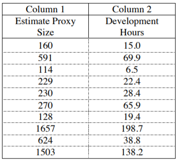
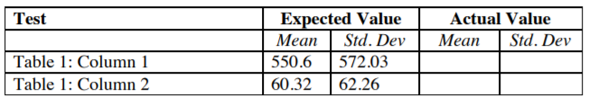
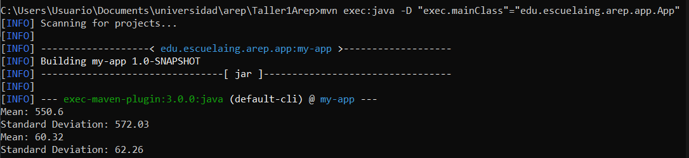

# Workshop #1 - AREP Stadistic Calculator

Program to calculate the mean and standard deviation of a set of n real numbers. The program reads the n real numbers from a file and use a linked list implementation to store the n numbers to do the calculations.

## Doubly linked list

In this workshop a doubly linked list (DLL) was implemented, a doubly linked list is a linked list which contain an extra pointer to the previous node, it also has a pointer to the next node, as well as a data field to represent the actual value stored in the node.

 

Taken from [GeeksforGeeks](https://www.geeksforgeeks.org/doubly-linked-list/)

The typical operations over a doubly linked list are:

1. Insert a value, this will create a Node and insert it on the tail.

2. Delete a value, this will find the first node that match with the given value an remove it.

## Getting Started

The following instructions will allow you to have a copy of the project and run it on your machine.

### Prerequisites

* [Maven](https://maven.apache.org/) - Dependency Management

* [Java 8](https://www.oracle.com/co/java/technologies/javase/javase-jdk8-downloads.html) -  Development Environment 

* [Git](https://git-scm.com/) - Version Control System

### Installing

1. Clone the repository

```
git clone https://github.com/juancamilo399/Taller1Arep.git
```

2. Compile the projet

```
mvn package
```

3. Executing the program

```
mvn exec:java -D "exec.mainClass"="edu.escuelaing.arep.app.App"
```

4. Generating the documentation

```
mvn javadoc:javadoc
```

The documentation will be generated in target/site/apidocs/index.html.

[Documentation](https://juancamilo399.github.io/Taller1Arep/apidocs/index.html)

## Running the tests

To run the unit tests

```
mvn test
```

## Test Data

In this workshop we have two test cases along with their respective mean and standard deviation.

In the following tables you can see the test data and the expected results.

 
 

Finally, the following figure shows the results obtained



Observing the results we can see that these are equal to the expected ones so the program behaves correctly when making the corresponding calculations.


## Built With

* [Maven](https://maven.apache.org/) - Dependency Management

## Inform

* [View inform](https://github.com/juancamilo399/Taller1Arep/blob/master/resources/Inform.pdf)

## Author

* **Juan Camilo Angel Hernandez** 


## License

This project is under GNU General Public License - see the [LICENSE](LICENSE) file for details
